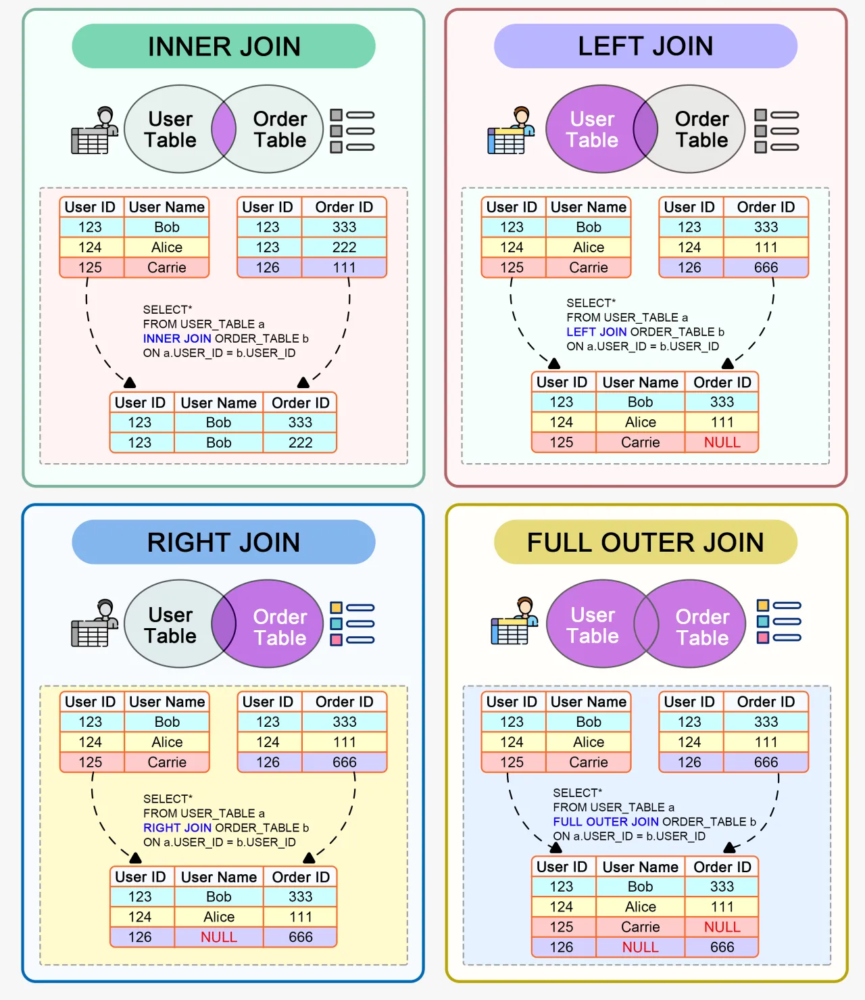

# JOINS in SQL

- In SQL, JOINS is used to combine rows from two or more tables based on a related column between them.
- Joins are essential for querying data spread across multiple tables and are a fundamental aspect of relational database management.

  

## Types of JOINS

#### **1. INNER JOIN**

- The INNER JOIN selects records that have matching values in both tables.
- It returns rows when there is a match in both tables.
- INNER JOIN is the by default JOIN applied, when a JOIN is specified in a query.

- Syntax:

  ```sql
  SELECT columns
  FROM table1
  INNER JOIN table2
  ON table1.common_column = table2.common_column;
  ```

- Example:

  ```sql
  SELECT employees.employee_id, employees.first_name, departments.department_name
  FROM employees
  INNER JOIN departments
  ON employees.department_id = departments.department_id;
  ```

  - Explanation:
    - This query selects the `employee_id` and `first_name` from the employees table and the `department_name` from the departments table where there is a matching `department_id` in both tables.

#### **2. LEFT JOIN**

- The LEFT JOIN (or LEFT OUTER JOIN) returns all records from the left table (table1), and the matched records from the right table (table2).
- If there is no match, the result is NULL on the side of the right table.

- Syntax:

  ```sql
  SELECT columns
  FROM table1
  LEFT JOIN table2
  ON table1.common_column = table2.common_column;
  ```

- Example:

  ```sql
  SELECT employees.employee_id, employees.first_name, departments.department_name
  FROM employees
  LEFT JOIN departments
  ON employees.department_id = departments.department_id;
  ```

  - Explanation:
    - This query selects all employees, including those who do not belong to any department.
    - For employees without a matching department_id in the departments table, the department_name will be NULL.

#### **3. RIGHT JOIN**

- The RIGHT JOIN (or RIGHT OUTER JOIN) returns all records from the right table (table2), and the matched records from the left table (table1).
- If there is no match, the result is NULL on the side of the left table.

- Syntax:

  ```sql
  SELECT columns
  FROM table1
  RIGHT JOIN table2
  ON table1.common_column = table2.common_column;
  ```

- Example:

  ```sql
  SELECT columns
  FROM table1
  RIGHT JOIN table2
  ON table1.common_column = table2.common_column;
  ```

  - Explanation:
    - This query selects all departments, including those with no employees.
    - For departments without a matching department_id in the employees table, the employee_id and first_name will be NULL.

#### **4. FULL JOIN**

- The FULL JOIN (or FULL OUTER JOIN) returns all records when there is a match in either left (table1) or right (table2) table records.
- If there is no match, the result is NULL on the side where there is no match.

- Syntax:

  ```sql
  SELECT columns
  FROM table1
  FULL OUTER JOIN table2
  ON table1.common_column = table2.common_column;
  ```

- Example:

  ```sql
  SELECT columns
  FROM table1
  FULL OUTER JOIN table2
  ON table1.common_column = table2.common_column;
  ```

  - Explanation:
    - This query returns all employees and all departments, matching where possible.
    - If an employee does not belong to a department, the department_name will be NULL.
    - If a department has no employees, the employee_id and first_name will be NULL.

#### **5. SELF JOIN**

- A SELF JOIN is a regular join, but the table is joined with itself.

- Syntax:

  ```sql
  SELECT A.column1, B.column2
  FROM table_name A, table_name B
  WHERE condition;
  ```

- Example:

  ```sql
  SELECT A.employee_id AS Employee, B.employee_id AS Manager
  FROM employees A, employees B
  WHERE A.manager_id = B.employee_id;
  ```

  - Explanation:
    - This query lists employees and their managers from the same employees table.
    - The table is aliased as A and B to perform the self join.

#### **6. CROSS JOIN**

- The CROSS JOIN returns the Cartesian product of the two tables, meaning it returns all possible combinations of rows from the two tables.

- Syntax:

  ```sql
  SELECT columns
  FROM table1
  CROSS JOIN table2;
  ```

- Example:

  ```sql
  SELECT employees.first_name, departments.department_name
  FROM employees
  CROSS JOIN departments;
  ```

  - Explanation:
    - This query returns all possible combinations of first_name from the employees table and department_name from the departments table.
    - If employees has 10 rows and departments has 5 rows, the result set will contain 50 rows.
